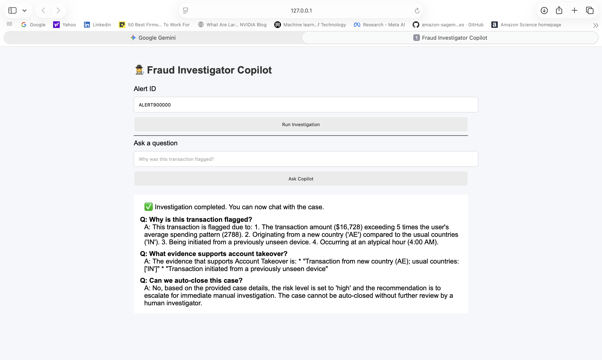

# Fraud Investigation Agent  
**Agentic AI System for BFSI Fraud Analysis & Investigator Copilot**

The project **agentic fraud investigation system** simulates how banks investigate suspicious transactions by creating **multiple specialized agents**, combining **deterministic risk logic** with **LLM-powered explanations**, and providing an **Investigator Copilot UI** to interactively analyze fraud cases.

---

## Key Capabilities

- Multi-agent fraud investigation pipeline  
- Deterministic risk scoring + rule-based detection  
- LLM-powered narrative generation (safe, explainable)  
- Investigator Copilot (chat with the case)  
- FastAPI backend + HTML UI  
- Fully local LLM execution using **Ollama (LLaMA 3.2:3B)**  
- Synthetic BFSI-grade data generation  

---

## System Architecture

```text
Alert ID
  │
  ▼
Fraud Orchestrator
  │
  ├── Behavioral Agent → User behavior deviation analysis
  ├── Pattern Agent → Known fraud pattern detection
  ├── Triage Agent → Risk level & priority assignment
  ├── Narrative Agent (LLM) → Human-readable fraud explanation
  │
  ▼
Final Verdict
  │
  ▼
Investigator Copilot (Chat)


---

## Agents Overview

### Behavioral Agent
- Compares transaction against historical user behavior
- Detects:
  - Amount deviation
  - New countries
  - New devices
  - Unusual transaction hours

### Pattern Agent
- Matches transactions against predefined fraud patterns
- Examples:
  - Account takeover indicators
  - Velocity anomalies
  - Geo-device inconsistencies

### Triage Agent
- Determines investigation urgency
- Assigns:
  - Risk level (`low / medium / high`)
  - Priority score


### Narrative Agent (LLM-powered)
- Uses **LLaMA 3.2 (local via Ollama)**
- Generates:
  - Clear fraud summary
  - Key risk indicators
- **LLM does NOT decide fraud** — it only explains why it's flagged as fraud using the data provided

### Investigator Copilot
- Allows investigators to **chat with the case**
- Answers questions like:
  - “Why is this transaction high risk?”
  - “What evidence supports escalation?”

---

## User Interface

- Simple HTML-based UI
- Features:
  - Enter Alert ID
  - Run investigation
  - Chat about the case (why it's fraud?)

## Application Screenshot



---

## Tech Stack

**Backend and Frontend**
- Python 3.10+
- FastAPI
- HTML for UI

**AI / ML**
- Rule-based fraud logic
- LLaMA 3.2 (via Ollama)

**Data**
- Synthetic transaction
  - Transaction data
  - User profile data
  - fraud rules 
  - alert transactions data

---
